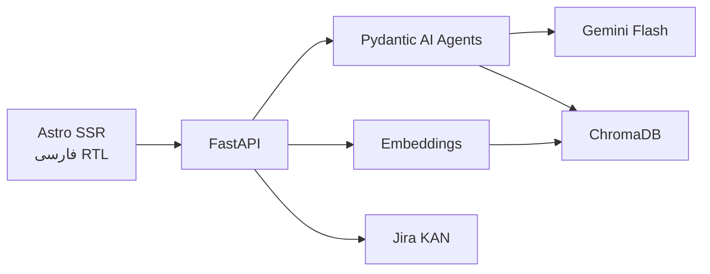

# دستیار جلسه سازمانی — Design Spec

**تاریخ:** 2026-05-26  
**آخرین به‌روزرسانی:** 2026-06-04 (Voice/Gemini transcribe, ChromaDB, RAG هوشمند, Jira EN, SSR)  
**وضعیت:** MVP پیاده‌شده  
**هدف:** MVP دمو با UI فارسی، ورود متن/صوت، RAG تک‌جلسه، استخراج تسک، Jira واقعی  
**مخزن:** https://github.com/Rvin-zh/meeting-assistant

---

## ۱. خلاصه

اپ **دستیار جلسه** transcript فارسی (paste، فایل متنی، یا **رونویسی صوت با Gemini**) می‌گیرد، با **Gemini** خلاصه و تسک استخراج می‌کند، **RAG** برای پرسش از همان جلسه دارد، و تسک‌ها را با preview به **Jira (KAN)** می‌فرستد. Issueهای Jira به **انگلیسی** ثبت می‌شوند؛ UI فارسی RTL است.

**Stack:**

| لایه | فناوری |
|------|--------|
| UI | Astro SSR (سبک، RTL فارسی) |
| API | FastAPI |
| Agentic | **Pydantic AI** (typed output) |
| LLM | `google:gemini-3.5-flash` |
| Embedding | `gemini-embedding-001` |
| Meetings DB | **SQLite** (`data/meetings.db`) — transcript, summary, tasks |
| Vector store | **ChromaDB** embedded (`data/chroma/`) |
| Jira | REST API v3 — پروژه `KAN` |

---

## ۲. معماری



### چرا Pydantic AI؟

- خروجی **ساختاریافته** با مدل‌های Pydantic (خلاصه، تسک‌ها)
- یکپارچه با **Google Gemini** via prefix `google:`
- RAG: retrieval در service layer + `rag_agent` برای تولید پاسخ طبیعی (نه tool loop سنگین)

### Agents (MVP)

| Agent | نقش | خروجی |
|-------|-----|--------|
| `analysis_agent` | ingest transcript | `MeetingAnalysis` (فارسی + `title_en` برای Jira) |
| `rag_agent` | پاسخ سوال با context از Chroma | `RagAnswer` |
| `chitchat` (helper) | سلام/hello | پاسخ کوتاه، بدون vector search |

Jira create از **API route** مستقیم — predictable برای دمو.

---

## ۳. مدل‌های Pydantic

```python
class MeetingTask(BaseModel):
    title: str
    title_en: str | None      # برای Jira summary
    assignee: str | None
    deadline: str | None
    priority: Literal["high", "medium", "low"]
    context: str
    context_en: str | None
    detail: str               # شرح ۲–۴ جمله‌ای برای Jira
    detail_en: str | None
    acceptance_criteria: list[str]
    acceptance_criteria_en: list[str]

class MeetingAnalysis(BaseModel):
    title: str
    title_en: str | None
    summary: str
    key_points: list[str]
    decisions: list[str]
    tasks: list[MeetingTask]

class RagAnswer(BaseModel):
    answer: str
    sources: list[ChunkCitation]  # footnote کوتاه، نه dump خام

class ChunkCitation(BaseModel):
    speaker: str
    text: str
    chunk_id: str
```

---

## ۴. API Routes

| Method | مسیر | Logic |
|--------|------|-------|
| GET | `/api/meetings` | لیست جلسات |
| POST | `/api/transcribe` | multipart audio → Gemini → transcript فارسی |
| POST | `/api/meetings` | parse → Chroma index → `analysis_agent` |
| GET | `/api/meetings/{id}` | جزئیات |
| GET | `/api/meetings/{id}/facilitation` | `facilitation_agent` — راهنمای برگزارکننده ✅ |
| POST | `/api/meetings/{id}/ask` | small-talk یا Chroma + `rag_agent` |
| POST | `/api/meetings/{id}/jira/preview` | map tasks → issue payload (EN) |
| POST | `/api/meetings/{id}/jira/create` | Jira REST |
| GET | `/api/health` | env status |

Frontend: `PUBLIC_BACKEND_URL` (پیش‌فرض `http://127.0.0.1:8000`).

---

## ۵. Pipeline

### Voice (optional pre-step)

1. User uploads audio (`mp3`, `wav`, `webm`, …) or records in browser
2. `POST /api/transcribe` → Gemini `generateContent` with inline audio (same `GOOGLE_API_KEY`)
3. Returns Persian transcript `[MM:SS] speaker: text` — user edits, then normal ingest

### Ingest

1. Parse transcript: `[HH:MM] name: text`
2. Chunk: ۳–۵ turn گفتگو
3. Embed با `gemini-embedding-001` → upsert در Chroma collection `meeting_chunks` (metadata: `meeting_id`, `speaker`, …)
4. `analysis_agent.run(transcript)` → ذخیره در SQLite (`meetings` table)

### RAG

1. اگر `is_small_talk(question)` → پاسخ chitchat، `sources=[]`
2. وگرنه: Chroma `query` با فیلتر `meeting_id`, `top_k=4`
3. Context به‌صورت داخلی به `rag_agent` — پاسخ فارسی طبیعی + footnote کوتاه در صورت نیاز
4. فلگ `used_meeting_context` در پاسخ API

### Jira

- Preview / Create: `summary` از `title_en`؛ `description` فارسی ساخت‌یافته از `detail` + `acceptance_criteria` + metadata جلسه
- `POST /rest/api/3/issue` به پروژه `KAN`
- Assignee فقط در description (MVP)

### Observability (Logfire)

- `backend/observability.py`: `logfire.configure(send_to_logfire='if-token-present')`
- Instrumentation: Pydantic AI agents, HTTPX (Gemini/Jira), FastAPI routes
- Manual spans: `ingest_meeting` → `analyze_transcript` → `index_vectors`
- Env: `LOGFIRE_TOKEN`, `LOGFIRE_SERVICE_NAME`, `LOGFIRE_ENVIRONMENT`
- Health: `GET /api/health` → `logfire: bool`

---

## ۶. UI (Astro SSR RTL)

| صفحه | مسیر | یادداشت |
|------|------|---------|
| خانه | `/` | ingest + لیست |
| جلسه | `/meeting/[id]` | **SSR fetch** از FastAPI — تب خلاصه · تسک · پرسش |
| تنظیمات | `/settings` | env hints |

`dir="rtl"`, فونت Vazirmatn, کد/URL در `dir="ltr"`.

---

## ۷. داده مصنوعی

`data/synthetic/meeting-01-scrum.txt`
`data/synthetic/meeting-02-planning.txt`
`data/synthetic/meeting-03-review.txt`
`data/synthetic/meeting-04-client-kickoff.txt`

پس از مهاجرت به Chroma، جلسات قدیمی را یک‌بار **دوباره ingest** کنید.

---

## ۸. Env

```
GOOGLE_API_KEY=
GEMINI_MODEL=google:gemini-3.5-flash
EMBEDDING_MODEL=gemini-embedding-001
JIRA_SITE_URL=https://arvinzaheri17.atlassian.net
JIRA_PROJECT_KEY=KAN
JIRA_EMAIL=
JIRA_API_TOKEN=
PUBLIC_BACKEND_URL=http://127.0.0.1:8000
```

---

## ۹. ساختار Repo

```
project/
├── frontend/          # Astro SSR
├── backend/
│   ├── main.py
│   ├── agents/        # analysis.py, rag.py
│   ├── services/      # vector_store (Chroma), embeddings, jira, ingest
│   └── models/
├── data/
│   ├── synthetic/
│   ├── meetings.db    # gitignored — SQLite
│   └── chroma/        # gitignored
├── docs/              # HTML + CHANGELOG.md
├── scripts/           # run-backend, run-tests, run-live-tests
└── .env
```

---

## ۱۰. خطاها

| خطا | پاسخ |
|-----|------|
| Gemini fail | retry ×1 |
| Invalid transcript | هشدار + `[ناشناس]` |
| Jira 401 | پیام فارسی env |
| RAG empty | «در این جلسه یافت نشد» |

---

## ۱۱. تست

| نوع | دستور | تعداد |
|-----|--------|-------|
| Unit (mock) | `./scripts/run-tests.sh` | 137 |
| Live API | `./scripts/run-live-tests.sh` | 12 |

پوشش: parser، Chroma vector_store، RAG small-talk، agents (mock).

---

## ۱۲. Sprintهای آینده

**جزئیات کامل:** [future-sprints-roadmap.md](future-sprints-roadmap.md) · [03-roadmap-and-future-work.html](../../03-roadmap-and-future-work.html)  
**در MVP:** رونویسی فایل/ضبط با Gemini (`/api/transcribe`)  
**برنامه Sprint 6+:** [Roadmap & Future Work](../../03-roadmap-and-future-work.html) — facilitation guide، SOW alignment، sentiment  
**خارج از scope (فعلاً):** STT زنده/streaming، diarization حرفه‌ای، Cloud Speech-to-Text جدا

| Sprint | قابلیت |
|--------|--------|
| ۶+ | ✅ `facilitation_agent` — راهنمای برگزارکننده؛ `alignment_agent` — SOW/قرارداد؛ `sentiment_agent` — لحن گوینندگان ([spec](../../03-roadmap-and-future-work.html)) |
| ۲ | RAG چندجلسه، FTS آرشیو، export خلاصه، compare agent |
| ۳ | Jira assignee map، `jira_agent`، OAuth، ویرایش قبل از create |
| ۴ | Auth، workspace/RBAC، تقویم (metadata)، ایمیل/Slack |
| ۵ | PostgreSQL، queue ingest، observability، deploy، eval |
| ۶+ | Multi-agent orchestrator، decision tracking، dashboard، Confluence |

---

## ۱۳. اسناد و نگهداری

| سند | نقش |
|-----|-----|
| `docs/01-project-overview.html` | چشم‌انداز و چارچوب AI-native |
| `docs/02-implementation.html` | جزئیات فنی |
| `docs/03-roadmap-and-future-work.html` | نقشه راه و قابلیت‌های پیشرفته |
| `docs/CHANGELOG.md` | **با هر تغییر معماری به‌روز شود** |
| این spec | مرجع مهندسی |

**قانون:** پس از هر تغییر مهم → یک خط CHANGELOG + بخش مربوط در HTML/spec.
